<div align="center">

# 🏪 Saarthi.ai

**An AI-powered shop management platform for India's shopkeepers** — speak or type a sale like you'd tell a friend, and Saarthi.ai turns it into structured sales, stock, credit (udhaar) and profit numbers automatically — with the AI never allowed to touch the math.

[](#-tech-stack)
[](#-tech-stack)
[](#-tech-stack)
[](#-tech-stack)
[](#-tech-stack)
[](#-tech-stack)

[**🚀 Live App**](https://saarthi-ai-frontend.onrender.com) · [System Design Write-up](./SYSTEM_DESIGN.md)

</div>

<br/>

<p align="center">
  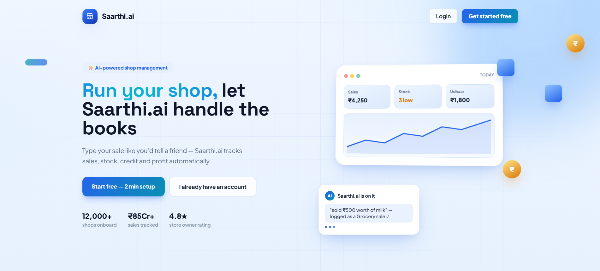
</p>

---

## 📖 Table of Contents

- [What this is](#-what-this-is)
- [Features](#-features)
- [Architecture](#-architecture)
- [The Golden Rule — AI Never Calculates](#-the-golden-rule--ai-never-calculates)
- [Multi-Tenant Isolation](#-multi-tenant-isolation)
- [Product Walkthrough](#-product-walkthrough)
- [Tech Stack](#-tech-stack)
- [Project Structure](#-project-structure)
- [Getting Started](#-getting-started)
- [Environment Variables](#-environment-variables)
- [Database Schema](#-database-schema)
- [API Reference](#-api-reference)
- [System Design](#-system-design)
- [Deployment](#-deployment)
- [Live Demo](#-live-demo)

---

## 🧭 What this is

Small shop owners across India — kirana stores, tailors, freelancers — mostly don't maintain formal books. Saarthi.ai meets them where they already are: type or speak a sale the way you'd casually tell a friend ("sold ₹500 worth of milk"), and the app turns it into a structured, categorized entry on its own.

Every shop signs up as its own isolated **Tenant**, with one or more **Users** underneath it (owner + staff). From there the dashboard shows today's/week's/month's sales, expenses and net profit at a glance, low-stock and revenue-drop alerts fire automatically, and customer credit (**udhaar**) is tracked as an append-only ledger so a balance can never silently drift out of sync.

---

## ✨ Features

<table>
<tr><td width="33%" valign="top">

### 🧾 Entries
- **Speak-to-add**: type free text, speak it out loud, or snap a photo of a bill/khata page — AI turns it into a sale/expense entry
- Manual entry form as a fallback, always
- Full entry history with delete
- AI-written daily greeting summarizing today's numbers

</td><td width="33%" valign="top">

### 📊 Analytics & Reports
- Live dashboard: today / this week / this month
- Sales vs expenses charts (Area/Bar/Line/Pie)
- Category-wise breakdown of sales & expenses
- "Explain this number" AI popup on any stat card
- Date-range reports with CSV export

</td><td width="33%" valign="top">

### 📦 Stock & 💰 Udhaar
- Track items with unit, quantity & low-stock threshold
- Restock / usage / adjustment movement history
- Add customers and log credit given vs payments received
- Running balance always derived from the ledger, never stored
- AI-drafted WhatsApp-style reminders, sent by SMS or email

</td></tr>
</table>

**Auth & accounts** — Register with email OTP verification or sign in with Google, JWT-based sessions, password reset flow, and a public `/system-health` status page for uptime checks.

---

## 🏗️ Architecture

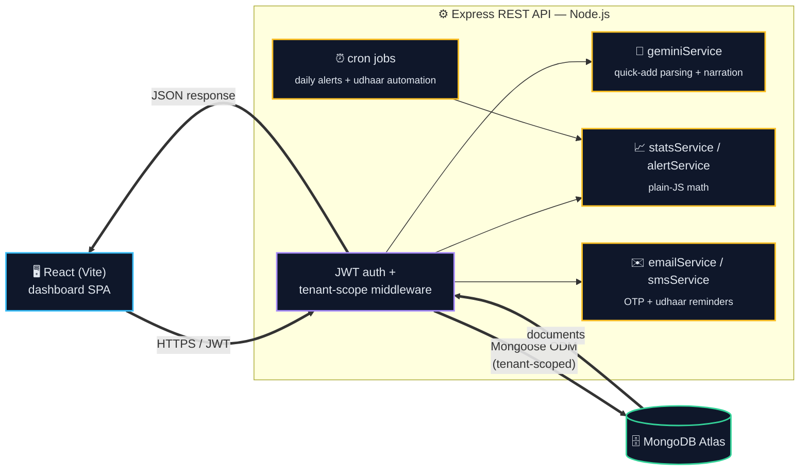

- **Frontend** — one React SPA (Vite), a single Axios-style API client, and page trees for Dashboard, Analytics, Stock, Udhaar, Alerts and Reports behind a login-gated layout.
- **Backend** — layered `routes → controllers → services/models`, every protected route behind JWT auth + a tenant-scoping middleware.
- **geminiService** — the *only* module allowed to call the Gemini API; it never sees or produces final numbers, only structured guesses or narration of numbers it's handed.
- **statsService / alertService / udhaarService** — pure, reusable, plain-JS modules that do every calculation in the app.

---

## 🧠 The Golden Rule — AI Never Calculates

> **The AI (Gemini) never calculates a number. All math — totals, percentages, balances, projections — is plain JavaScript on numbers already sitting in the database. Gemini only ever narrates or structures numbers it's handed.**

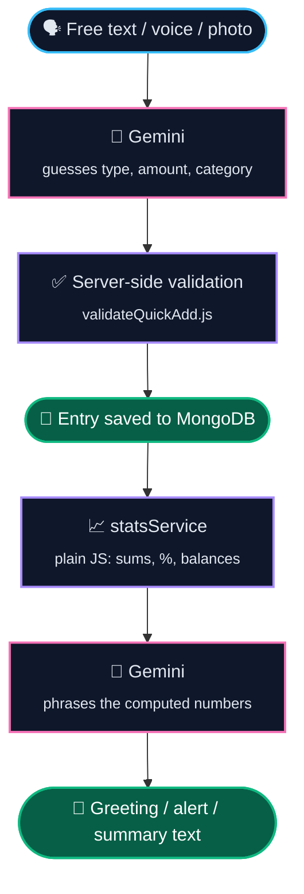

This is why `/api/analytics/overview` and `/api/entries/stats` are **fast, DB-only endpoints** the dashboard renders from immediately — while `/api/analytics/summary`, the daily greeting, and udhaar reminders are separate, slower, **AI-backed endpoints** the frontend loads independently so a flaky AI call never blocks real numbers from showing.

---

## 🔒 Multi-Tenant Isolation

Every shop is a `Tenant`, and every other collection (`User`, `Entry`, `StockItem`, `UdhaarCustomer`, `UdhaarTransaction`, `Alert`) carries a `tenantId`. All reads/writes go through a `scopeToTenant` middleware helper — no controller is allowed to query a collection with a raw `tenantId` pulled straight from `req.body` or `req.params`, so one shop's data can never leak into another's dashboard.

---

## 🖼️ Product Walkthrough

### 1️⃣ Landing & Onboarding

<p align="center">
  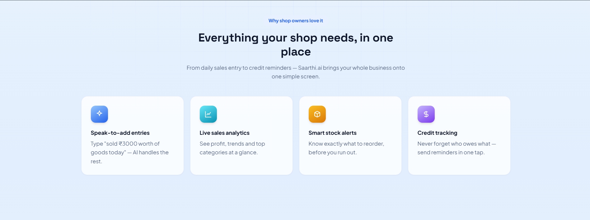
</p>
<p align="center"><em>Speak-to-add entries, live sales analytics, smart stock alerts and credit tracking — the four pillars of the app.</em></p>

<p align="center">
  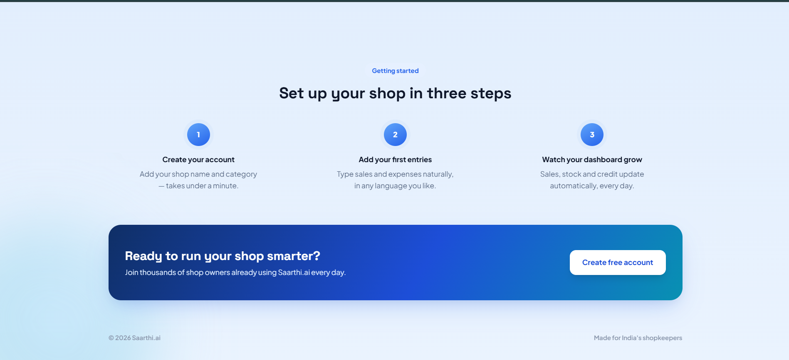
</p>
<p align="center"><em>Set up a shop in three steps — no formal bookkeeping knowledge required.</em></p>

### 2️⃣ Sign Up & Login

<table>
<tr>
<td width="50%">

**Login — email/password or Google**
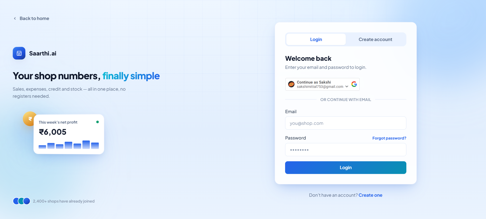
</td>
<td width="50%">

**Create account — first 50 entries free**
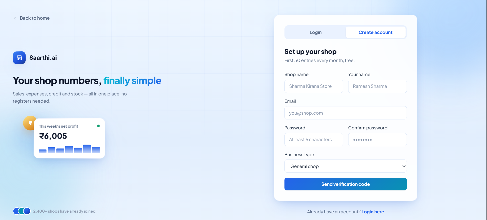
</td>
</tr>
</table>

### 3️⃣ Dashboard

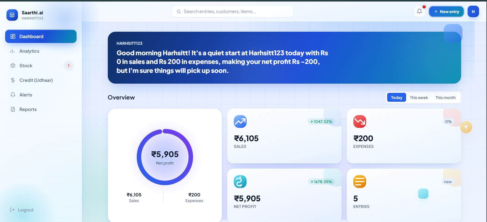
<p align="center"><em>AI-written greeting up top, then today's/week's/month's sales, expenses, net profit and entry count at a glance.</em></p>

### 4️⃣ Adding an Entry — AI or Manual

<table>
<tr>
<td width="50%">

**Say what happened — AI parses it**
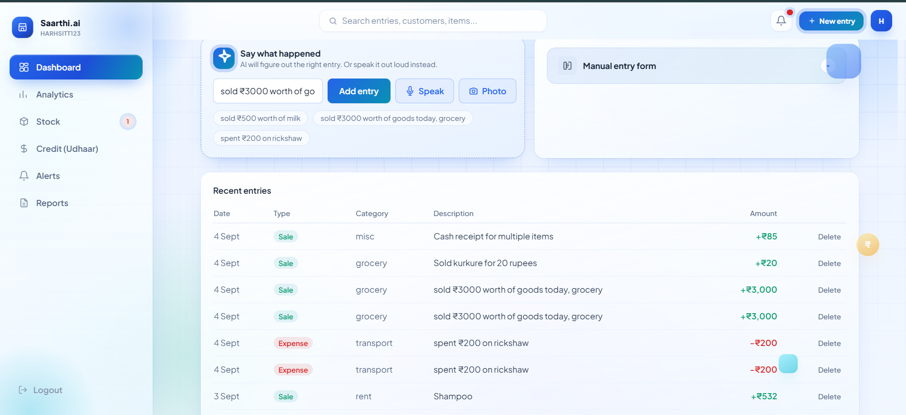
</td>
<td width="50%">

**Manual entry form — always available**
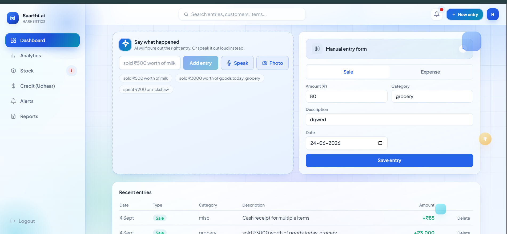
</td>
</tr>
</table>

### 5️⃣ Analytics

One dataset, four ways to read it. The same `/api/analytics/overview` response drives all four chart views below — switching tabs is instant (no refetch), and hovering any point shows the exact sales/expense split for that day. Pick whichever shape answers your question fastest: **Area** for the overall trend at a glance, **Bar** to compare specific days, **Line** to spot the exact day something changed, **Pie** for the sales-vs-expenses split over the whole range.

<table>
<tr>
<td width="50%">

**Area — overall trend**
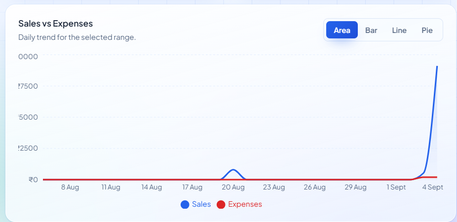
</td>
<td width="50%">

**Bar — day-by-day comparison, with tooltip**
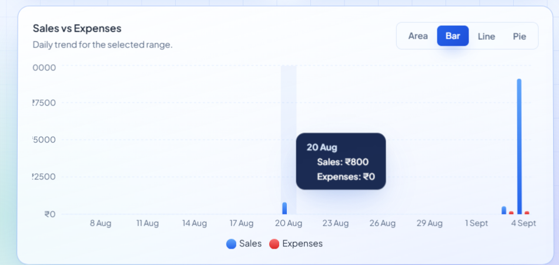
</td>
</tr>
<tr>
<td width="50%">

**Line — pinpoint the exact day something changed**
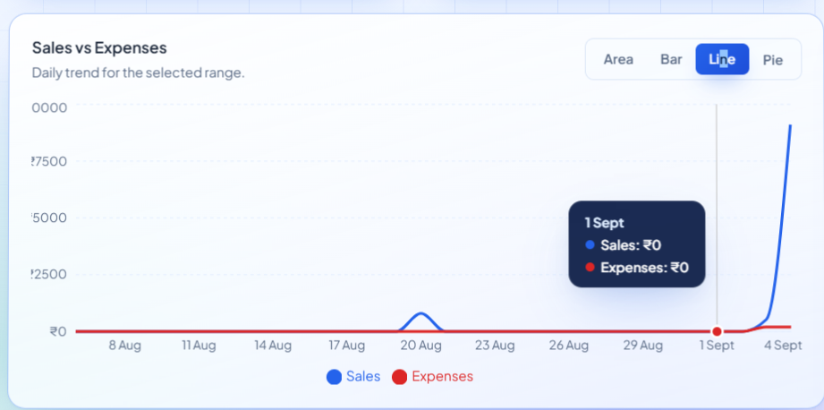
</td>
<td width="50%">

**Pie — sales vs expenses split for the range**
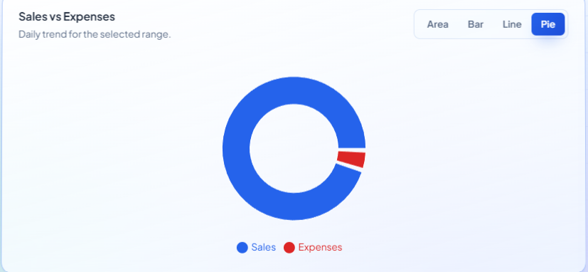
</td>
</tr>
</table>

Below the chart, `CategoryBreakdown` ranks categories by amount so an owner can answer "what's actually driving this number" in one glance, and `ExplainNumberModal` lets them tap any stat card to get a short AI-written explanation of it — grounded strictly in the numbers already computed by `statsService`, per the [golden rule](#-the-golden-rule--ai-never-calculates).

### 6️⃣ Stock

<table>
<tr>
<td width="50%">

**Add a stock item with a low-stock threshold**
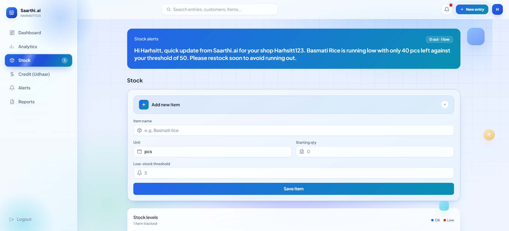
</td>
<td width="50%">

**Stock levels chart + item table**
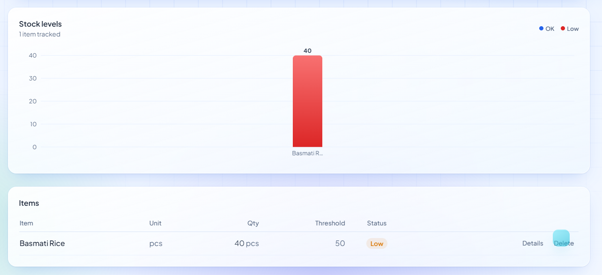
</td>
</tr>
</table>

### 7️⃣ Credit (Udhaar)

<table>
<tr>
<td width="50%">

**Add a customer**
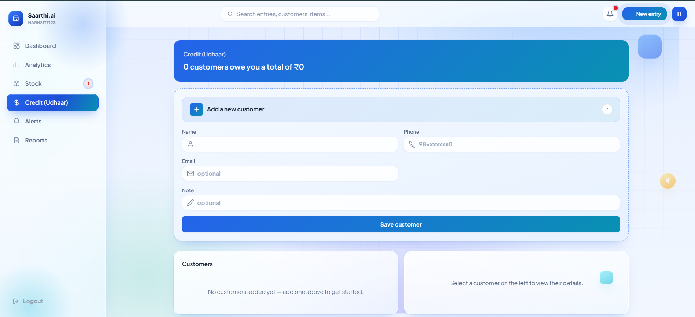
</td>
<td width="50%">

**Customer ledger + AI-drafted reminder**
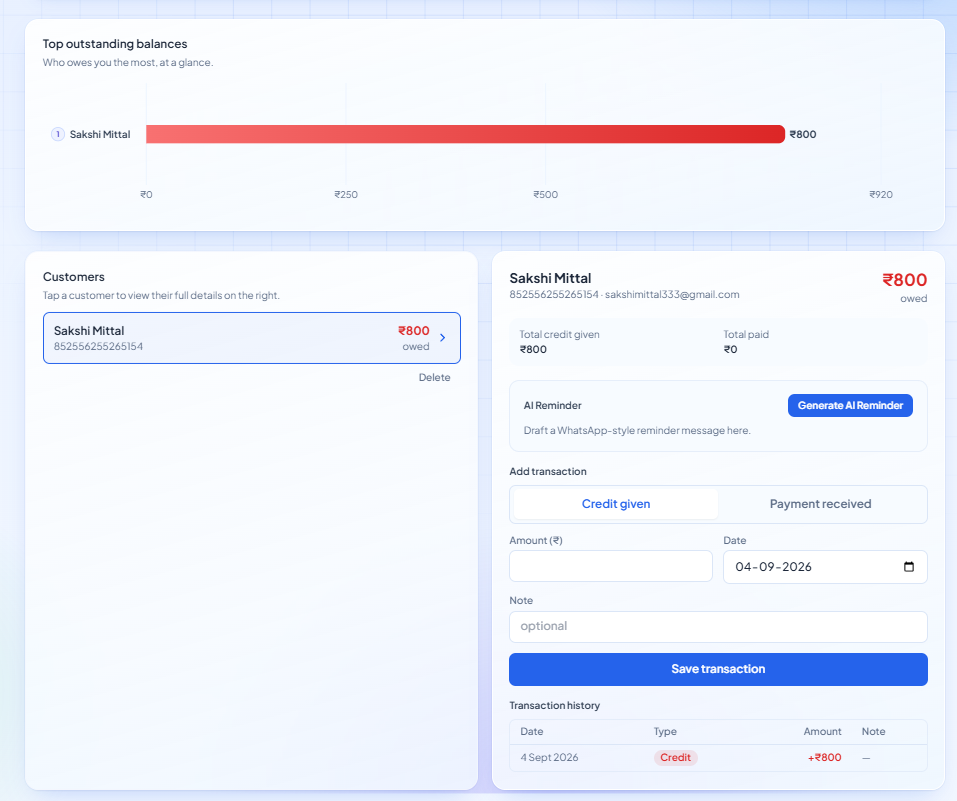
</td>
</tr>
</table>

### 8️⃣ Alerts & Reports

<table>
<tr>
<td width="50%">

**Low-stock / revenue-drop alerts**
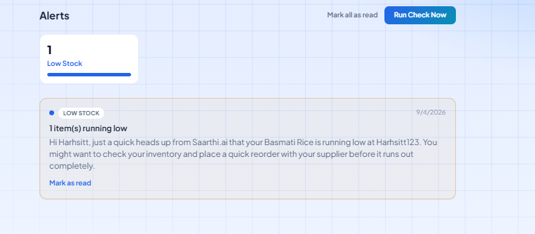
</td>
<td width="50%">

**Date-range reports with category breakdown**
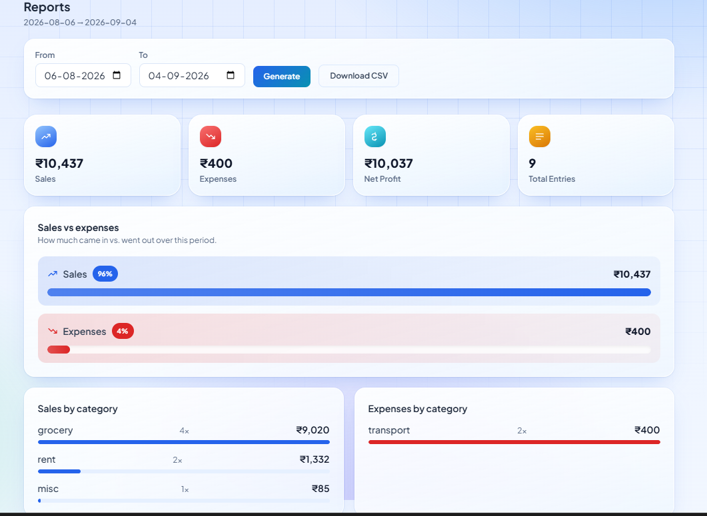
</td>
</tr>
</table>

---

## 🧰 Tech Stack

| Layer | Technology |
|---|---|
| Frontend | React 18 (Vite), React Router, Recharts, i18next |
| Backend | Node.js, Express |
| Database | MongoDB + Mongoose |
| AI | Google Gemini (`gemini-2.0-flash`) — text, voice & image quick-add, narration |
| Auth | JWT, bcryptjs, email OTP, Google Identity Services (`@react-oauth/google`) |
| Notifications | Gmail API (OAuth2) for email, TextBee for SMS |
| Jobs | node-cron (daily alert checks + udhaar automation) |
| Security | Helmet, express-mongo-sanitize, express-rate-limit |
| Testing | Jest, Supertest, mongodb-memory-server |
| Hosting | Render (backend + frontend), MongoDB Atlas |

---

## 📁 Project Structure

```
Dukkain-ai-ekdmfinal/
├── backend/
│   ├── src/
│   │   ├── config/          # DB connection
│   │   ├── controllers/     # auth, entries, analytics, stock, udhaar, alerts, reports...
│   │   ├── middleware/      # JWT auth guard, tenant scoping, rate limiters
│   │   ├── models/          # Tenant, User, Entry, StockItem, UdhaarCustomer, UdhaarTransaction, Alert
│   │   ├── routes/          # Express routers
│   │   ├── services/        # geminiService, statsService, alertService, udhaarService, email/sms...
│   │   ├── jobs/            # alertCron, udhaarCron
│   │   ├── utils/           # jwt, cache, languages
│   │   ├── app.js
│   │   └── server.js
│   ├── tests/                # Jest + Supertest integration tests
│   ├── .env.example
│   └── package.json
├── frontend/
│   ├── src/
│   │   ├── components/
│   │   │   ├── dashboard/     # GreetingBanner, StatCard, QuickAdd, ManualEntryForm, ProfitGauge...
│   │   │   ├── analytics/     # SalesExpensesChart, CategoryBreakdown, ExplainNumberModal...
│   │   │   ├── stock/         # AddStockItemForm, StockLevelsChart, StockTable...
│   │   │   ├── udhaar/        # AddCustomerForm, CustomerDetail, AiReminderPanel...
│   │   │   ├── alerts/
│   │   │   └── layout/        # AppHeader
│   │   ├── pages/              # Landing, Auth, Dashboard, Analytics, Stock, Udhaar, Alerts, Reports, SystemHealth
│   │   ├── lib/                 # api.js, auth.js, format.js, i18next.js
│   │   ├── locales/             # en.json
│   │   ├── App.jsx
│   │   └── main.jsx
│   ├── .env.example
│   └── package.json
├── scripts/                  # migrate-language-pref-to-english.js
└── README.md
```

---

## 🚀 Getting Started

### Prerequisites
- Node.js 18+
- A MongoDB connection string (Atlas free tier works fine)
- A Google Gemini API key
- (Optional) A Google OAuth Client ID for Google Sign-In
- (Optional) Gmail API OAuth2 credentials for OTP/reminder emails, and a TextBee account for SMS reminders

### 1. Backend

```bash
cd backend
npm install
cp .env.example .env      # fill in your own values
npm run dev                # or: npm start
```

API runs on `http://localhost:5000` by default.

### 2. Frontend

```bash
cd frontend
npm install
cp .env.example .env      # fill in your own values
npm run dev
```

Frontend runs on the default Vite port and talks to the backend via `VITE_API_URL`.

### 3. Tests

```bash
cd backend
npm test
```

Runs the Jest + Supertest suite against an in-memory MongoDB instance (`mongodb-memory-server`) — no real database needed.

---

## 🔐 Environment Variables

**`backend/.env`**

| Variable | Description |
|---|---|
| `MONGODB_URI` | MongoDB connection string |
| `JWT_SECRET` | Secret used to sign auth tokens |
| `JWT_EXPIRES_IN` | Token expiry (e.g. `7d`) |
| `PORT` | Port the API listens on |
| `GEMINI_API_KEY` | Google Gemini API key, powers quick-add + AI narration |
| `GEMINI_MODEL` | Optional, defaults to `gemini-2.0-flash` |
| `NODE_ENV` | Node environment |
| `TEXTBEE_API_KEY` / `TEXTBEE_DEVICE_ID` | TextBee (Android SMS gateway) credentials for udhaar SMS reminders |
| `GOOGLE_CLIENT_ID` / `GOOGLE_CLIENT_SECRET` / `GOOGLE_REFRESH_TOKEN` | Gmail API OAuth2 credentials for OTP & reminder emails |
| `GMAIL_SENDER_EMAIL` | Sender address for outgoing email |
| `CORS_ORIGINS` | Comma-separated list of allowed frontend origins |

**`frontend/.env`**

| Variable | Description |
|---|---|
| `VITE_API_URL` | `http://localhost:5000` locally; deployed backend URL in production |
| `VITE_GOOGLE_CLIENT_ID` | Same Google Client ID as the backend — safe to expose publicly |

Full, commented templates live in `backend/.env.example` and `frontend/.env.example`.

---

## 🗄️ Database Schema

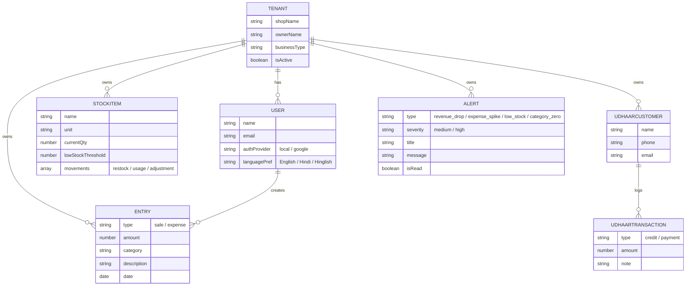

| Collection | Purpose |
|---|---|
| **Tenant** | One shop/business. Every other collection carries a `tenantId` pointing back here, and every query is routed through a tenant-isolation helper. |
| **User** | Belongs to exactly one tenant; `local` (bcrypt-hashed password + OTP) or `google` auth provider. |
| **Entry** | A single sale or expense — the row everything else (stats, analytics, alerts) is computed from. AI never touches these numbers after creation. |
| **StockItem** | An inventory item with a low-stock threshold and a movement sub-log (`restock`/`usage`/`adjustment`) so quantity history is always auditable. |
| **UdhaarCustomer** | A customer the shop extends credit to. Balance owed is *never* stored — always derived from the ledger. |
| **UdhaarTransaction** | One ledger line (`credit` or `payment`) for a udhaar customer. |
| **Alert** | Deterministic-rule-triggered alert (low stock, revenue drop, etc.), at most one per `(tenant, type, day)`, optionally phrased by Gemini. |

---

## 📡 API Reference

Base URL: `/api`. All routes except `register`/`login`/`google`/`forgot-password`/`reset-password`/`/system-health` require a `Bearer` JWT — the live backend URL only serves JSON under this base path, so opening it bare in a browser correctly shows a 404; hit `https://saarthi-ai-umhe.onrender.com/api/health` for a liveness check instead.

**How a request actually flows, end to end:**

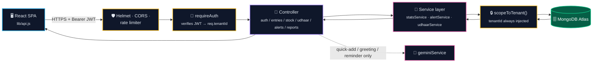

Every arrow above is a real, tested path in this repo — not aspirational. Full reasoning for each piece lives in [`SYSTEM_DESIGN.md`](./SYSTEM_DESIGN.md).

<details>
<summary><strong>Auth — <code>/api/auth</code></strong></summary>

| Method | Route | Access | Description |
|---|---|---|---|
| POST | `/register` | Public | Register a shop + owner account directly |
| POST | `/register/request-otp` | Public | Request an email OTP to verify a new account |
| POST | `/register/verify-otp` | Public | Confirm the OTP and activate the account |
| POST | `/login` | Public | Email/password login |
| POST | `/google` | Public | Google Sign-In (login or signup) |
| POST | `/forgot-password` | Public | Request a password reset email |
| POST | `/reset-password` | Public | Reset password with the emailed token |
| POST | `/logout` | Public | Clear the session |
| GET | `/me` | Authenticated | Current user's profile |
| PATCH | `/language` | Authenticated | Update the AI's response language (English/Hindi/Hinglish) |

</details>

<details>
<summary><strong>Entries — <code>/api/entries</code></strong></summary>

| Method | Route | Description |
|---|---|---|
| GET | `/stats` | Today/week/month sales, expenses & net profit |
| GET | `/greeting` | AI-written one-line greeting summarizing today's numbers |
| GET | `/categories` | Distinct categories used so far, for autocomplete |
| POST | `/quick-add` | Free-text entry → Gemini guesses the fields → validated → saved |
| POST | `/quick-add/voice` | Base64 audio → Gemini transcribes & structures → validated → saved |
| POST | `/quick-add/image` | Base64 bill/khata photo → Gemini reads & structures → validated → saved |
| GET | `/` | List entries |
| POST | `/` | Create an entry manually |
| DELETE | `/:id` | Delete an entry |

</details>

<details>
<summary><strong>Analytics — <code>/api/analytics</code></strong></summary>

| Method | Route | Description |
|---|---|---|
| GET | `/overview` | Fast, DB-only chart data — never waits on AI |
| GET | `/summary` | AI-backed narrative summary, loaded independently of `/overview` |
| POST | `/explain-number` | AI explanation for a specific stat, on demand |

</details>

<details>
<summary><strong>Stock — <code>/api/stock</code></strong></summary>

| Method | Route | Description |
|---|---|---|
| GET | `/alerts/low-stock` | Items currently below their threshold |
| GET | `/` | List stock items |
| POST | `/` | Create a stock item |
| GET | `/:id` | Get one item + its movement history |
| POST | `/:id/restock` | Log a restock movement (increases quantity) |
| POST | `/:id/usage` | Log a usage movement (decreases quantity) |
| DELETE | `/:id` | Delete an item |

</details>

<details>
<summary><strong>Udhaar — <code>/api/udhaar</code></strong></summary>

| Method | Route | Description |
|---|---|---|
| GET | `/summary` | Total outstanding + top debtors |
| POST | `/run-daily-jobs` | Manually trigger the udhaar automation job |
| GET | `/customers` | List udhaar customers |
| POST | `/customers` | Add a customer |
| GET | `/customers/:id` | Get a customer + full transaction history |
| POST | `/customers/:id/transactions` | Log a `credit` or `payment` |
| GET | `/customers/:id/reminder` | AI-drafted WhatsApp-style reminder text |
| POST | `/customers/:id/send-reminder` | Send the reminder via SMS/email |
| DELETE | `/customers/:id` | Delete a customer |

</details>

<details>
<summary><strong>Alerts — <code>/api/alerts</code></strong></summary>

| Method | Route | Description |
|---|---|---|
| GET | `/unread-count` | Number of unread alerts |
| PATCH | `/read-all` | Mark every alert as read |
| POST | `/run` | Manually run the alert-check rules ("Run Check Now") |
| GET | `/` | List alerts |
| PATCH | `/:id/read` | Mark one alert as read |

</details>

<details>
<summary><strong>Reports — <code>/api/reports</code></strong></summary>

| Method | Route | Description |
|---|---|---|
| GET | `/` | Date-range report: totals, category breakdown, entry count |

</details>

<details>
<summary><strong>System Health — <code>/api/system-health</code></strong> (Public)</summary>

| Method | Route | Description |
|---|---|---|
| GET | `/` | Public status endpoint backing the `/system-health` page |

</details>

---

## 🧩 System Design

The four decisions that shape this codebase most — click through to [`SYSTEM_DESIGN.md`](./SYSTEM_DESIGN.md) for the full diagrams + reasoning behind each one:

| # | Decision | One-line summary |
|---|---|---|
| 1 | [AI Quick-Add Pipeline](./SYSTEM_DESIGN.md#1-ai-quick-add-pipeline) | Text/voice/photo → Gemini *guesses* → `validateQuickAddResult()` sanitizes & caps it → only then does it touch MongoDB |
| 2 | [Multi-Tenant Isolation](./SYSTEM_DESIGN.md#2-multi-tenant-isolation) | Every query is routed through `scopeToTenant()`, which injects `tenantId` last on reads and strips it from writes — no controller can accidentally cross tenants |
| 3 | [Alert Automation](./SYSTEM_DESIGN.md#3-alert-automation) | Deterministic JS rules decide *if* and *how severe* an alert is; Gemini only phrases the sentence, and a `(tenant, type, day)` unique index stops duplicate spam |
| 4 | [Udhaar Ledger Integrity](./SYSTEM_DESIGN.md#4-udhaar-ledger-integrity) | A customer's balance is never stored — it's always `sum(credit) − sum(payment)`, recomputed from the transaction log, so it can never silently drift |

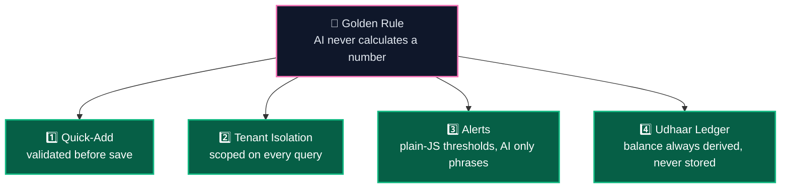

---

## ☁️ Deployment

- **Backend** → Render (root directory `backend`; build: `npm install`; start: `npm start`)
- **Frontend** → Render Static Site (root directory `frontend`; build: `npm run build`)
- **Database** → MongoDB Atlas (free tier)

Set `CORS_ORIGINS` on the backend to your deployed frontend URL, and `VITE_API_URL` on the frontend to your deployed backend URL.

---

## 🌐 Live Demo

| | Link |
|---|---|
| **Frontend** | [saarthi-ai-frontend.onrender.com](https://saarthi-ai-frontend.onrender.com) |
| **Backend API** | [saarthi-ai-umhe.onrender.com](https://saarthi-ai-umhe.onrender.com) |

> ⏳ Hosted on Render's free tier — the backend spins down after inactivity, so the first request may take 30–60s to wake up. That's expected, not a bug.

