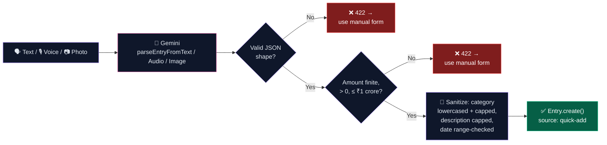
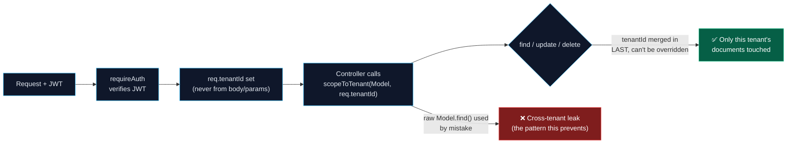
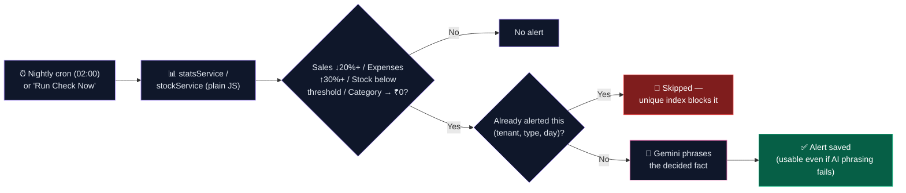
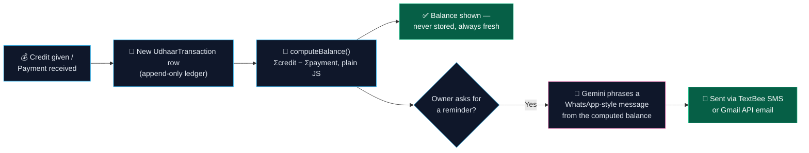

# System Design Write-Up

> The four things this project actually had to get right: **an AI that guesses but never decides**, **tenant isolation that can't be bypassed by accident**, **alerts that are honest, not noisy**, and **a credit ledger that can never silently drift from reality**.

This is the "why it's built this way" companion to [`README.md`](./README.md) (full API/schema reference lives there). Each section below is a one-line summary + the reasoning — click **▶ Show diagram** to expand the visual for that piece.

## Table of Contents
- [1. AI Quick-Add Pipeline](#1-ai-quick-add-pipeline)
- [2. Multi-Tenant Isolation](#2-multi-tenant-isolation)
- [3. Alert Automation](#3-alert-automation)
- [4. Udhaar Ledger Integrity](#4-udhaar-ledger-integrity)
- [Trade-offs, called out on purpose](#trade-offs-called-out-on-purpose)

---

## 1. AI Quick-Add Pipeline

**In one line:** free text / voice / photo → Gemini produces a *structured guess* → `validateQuickAddResult()` sanitizes, caps and defaults every field → only a fully validated object is ever written to MongoDB.

▶ Show diagram

**Why this shape:**
- **Gemini never writes to the database directly** — `entryController` calls `geminiService` to get a *guess*, then always routes it through `validateQuickAddResult()` before it ever reaches `Entry.create()`. This is the literal enforcement point of the golden rule: *the AI never calculates a number, and its shape is never trusted blindly either.*
- **A sanity cap, not just a type check** — an amount above ₹1 crore for a single kirana-store entry is almost certainly a misparse (e.g. Gemini echoing a phone number), so it's rejected outright rather than saved and silently skewing the dashboard.
- **Fails toward the manual form, not toward guessing harder** — if Gemini is unreachable or the parse doesn't pass validation, the API returns `422 { aiUnavailable }` so the frontend can drop straight to `ManualEntryForm` instead of retrying an unreliable AI call.
- **One validator, three entry points** — text (`quick-add`), voice (`quick-add/voice`), and photo (`quick-add/image`) all funnel through the *same* `validateQuickAddResult()`, so there's exactly one place that defines what a "safe" entry looks like, not three slightly different ones.

---

## 2. Multi-Tenant Isolation

**In one line:** every tenant-owned collection is queried through `scopeToTenant(Model, tenantId)`, which merges `tenantId` into reads *last* and strips it out of write payloads — so no controller, however it's written, can leak or overwrite another shop's data.

▶ Show diagram

**Why this shape:**
- **`tenantId` comes from the verified JWT, never from `req.body`/`req.params`** — a malicious or buggy client can't just pass a different `tenantId` and read someone else's shop.
- **Merged in *last* on reads, stripped out on writes** — `scopeToTenant`'s `find`/`findOne` spread `{ ...filter, tenantId }` (so a caller-supplied `tenantId` in the filter is silently overwritten), and every update helper runs the payload through `stripTenantId()` first, so an update can never reassign a document to a different tenant.
- **`findById` is `findOne({ _id, tenantId })`, not `Model.findById(id)`** — guessing another tenant's Mongo `_id` returns `null` instead of their document, which matters because Mongo IDs are guessable/enumerable if you know the format.
- **One helper, every model** — `User`, `Entry`, `StockItem`, `UdhaarCustomer`, `UdhaarTransaction`, and `Alert` are *all* accessed through this same helper, so there's one audited implementation of tenant isolation instead of one per controller.

---

## 3. Alert Automation

**In one line:** plain-JS threshold rules (in `alertService.js`) decide *if* and *how severe* an alert is from numbers `statsService`/`stockService` already computed; Gemini only phrases the sentence, and a unique `(tenant, type, day)` index stops the same alert from firing twice in one day.

▶ Show diagram

**Why this shape:**
- **Thresholds are hardcoded constants, not AI opinion** — `REVENUE_DROP_THRESHOLD_PCT`, `EXPENSE_SPIKE_THRESHOLD_PCT`, and each stock item's own `lowStockThreshold` decide whether an alert fires at all. Gemini is only ever handed an *already-decided* `{ type, title, context }` to turn into a sentence — it cannot cause an alert to fire or stay silent.
- **The AI step is allowed to fail without losing the alert** — `message` (Gemini's phrasing) can be `null` if the API call errors; the alert is still fully usable with its deterministic `title` and `context`.
- **A compound unique index (`tenantId, type, dateKey`) is the actual dedup mechanism**, not application logic that could be skipped by a bug — running the nightly cron *and* a manual "Run Check Now" click on the same day for the same tenant can only ever produce one `low_stock` alert, enforced at the database level.
- **Sequential per-tenant, not `Promise.all`** — the cron processes tenants one at a time so a slow Gemini call for one shop's alerts never competes with another shop's DB/API load; simple to reason about at this app's scale.

---

## 4. Udhaar Ledger Integrity

**In one line:** a customer's balance is never a stored field — it's always `sum(credit) − sum(payment)` recomputed from their `UdhaarTransaction` rows, so a missed update can never leave a stale number on screen.

▶ Show diagram

**Why this shape:**
- **No `balance` field on `UdhaarCustomer` at all** — every read recomputes it from that customer's transactions in `udhaarService.computeBalance()`. There is no cached number that could ever fall out of sync with the ledger it's supposed to summarize.
- **The ledger itself is append-only** — a payment doesn't edit or delete a credit row, it adds a new `payment` row; the full history (`transactionCount`, `lastTransactionAt`, `totalCredit`, `totalPaid`) stays reconstructable and auditable at any point.
- **Overpayment isn't silently clamped** — `computeBalance()` doesn't floor at zero, so if a customer pays more than they owe it's still visible rather than hidden, which matters for catching a data-entry mistake.
- **Gemini only phrases, never sums** — `generateUdhaarReminder` is handed the already-computed balance and customer name; it cannot introduce a number that wasn't calculated by `udhaarService` first.

---

## Trade-offs, called out on purpose

| Decision | What was chosen | What was traded off |
|---|---|---|
| Quick-add validation | Hard reject (422) on anything suspicious | No "best guess, fix it later" — a slightly-off AI parse never reaches the database, but the owner has to re-enter it manually |
| Alert thresholds | Fixed constants (e.g. -20% sales, +30% expenses) | Not tenant-tunable yet — same sensitivity for a ₹500/day stall and a ₹50,000/day store; a real limitation this list is honest about |
| Alert dedup | One alert per `(tenant, type, day)` | A metric can drop further later in the same day without a second alert — deliberately trades noise for signal |
| Udhaar balance | Always recomputed, never cached | Slightly more read-time computation as a customer's transaction history grows, in exchange for a balance that can never drift |
| Cron concurrency | Sequential per tenant, not parallel | Slower on a large tenant base; simple and safe at this app's current scale, with an obvious place to parallelize later |
